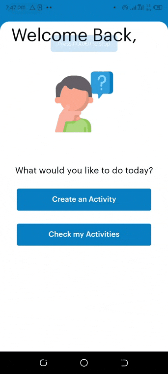

# Activity Monitor

A demo app which allows user to create an activity/task. 
The added activities can be edited and deleted.




## Getting Started
Note:if you do not have expo-cli installed on your machine
```bash
 npm install -g expo-cli
```
then
```bash
$ git clone https://github.com/lurdharry/ChallengeApp.git
$ cd ChallengeApp
$ yarn install
```

## Run 

```pyth
expo start
```
